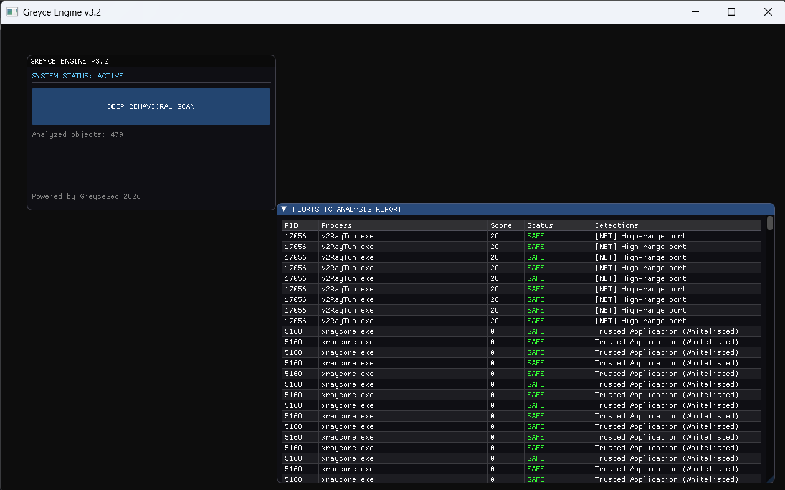

# RatChecker (Greyce Engine v3.2) 🛡️

**RatChecker** — это легковесный инструмент на C++ для **поиска раток (RAT)**, скрытых майнеров и подозрительного ПО. Программа использует графический интерфейс ImGui и предназначена для тех, кто хочет быстро **найти ратку** или **обнаружить скрытую сетевую активность** на базе эвристических правил.

## 🚀 Особенности
- **Heuristic Engine**: Помогает **обнаружить ратку** через анализ путей выполнения (Temp/AppData) и подозрительных имен процессов.
- **Network Monitoring**: Сканирование установленных TCP-соединений через `GetExtendedTcpTable` для выявления связи с C&C серверами.
- **UI**: Современный интерфейс на базе DirectX 11 и Dear ImGui.
- **Whitelisting**: Игнорирование доверенных процессов (например, XrayCore).

## 🛠️ Стек технологий
- **Язык**: C++ 
- **Графика**: DirectX 11
- **Интерфейс**: Dear ImGui
- **API**: Windows SDK (WinAPI, IP Helper)

## 📸 Скриншоты

## 🔍 Поисковые запросы / Keywords
`поиск ратки`, `найти ратку`, `обнаружить ратку`, `чек на ратки`, `RAT detection`, `malware analysis`, `C++ security tool`, `heuristic scanner`.

## ⚠️ Дисклеймер
Этот инструмент создан в образовательных целях для изучения основ кибербезопасности и системного программирования. Автор не несет ответственности за любое использование программы в противоправных целях.

---
**Разработано GreyceSec, 2026**
